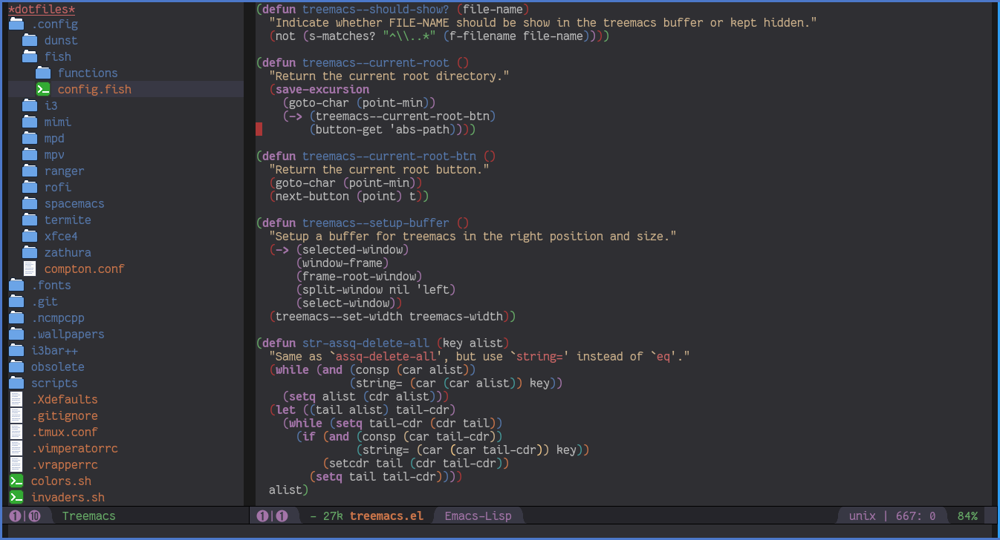

# Treemacs -- a tree style file explorer for Emacs

## Features

Treemacs is a file explorer like NeoTree or vim's NerdTree. It's displays the file system in a tree layout to allow easy exploration and
navigation as well as *basic* file management utilities. Specifically the single selling points are as follows:

 * Easy navigation - quickly change root directory, or use shortcuts to jump between parent and neighbouring nodes.
 * Versatile file access - decide exactly how and where a file will be opened, including using `ace-window` to chose a buffer or launching
   an external app via `xdg-open`.
 * Projectile integration - quickly open treemacs at any project's root directory.
 * Window numbering integration - Treemacs will always be assigned window number 0, never interfering with the numbering
   layout of your other windows.
 * Git integration - treemacs will optionally use different faces for files in different git states.
 * Ease of use - you need to (optionally) decide whether to use emacs default or evil nagivation keys (see `treemacs-be-evil` below).
   Other than that treemacs uses a mnemonic keymap inspired by spacemacs.

## Installation

 Treemacs is still in testing and not yet available on MELPA, thus for now must be loaded manually.

 Set `treemacs-be-evil` to t before loading treemacs if you want evil-mode integration.
 Once this is done Treemacs is ready to be used by calling `treemacs-init`, `treemacs-toggle` or `treemacs-projectile-init`.

## Configuration

Treemacs offers the following configuration variables:

 * `treemacs-be-evil` (default value: nil)
    If t when treemacs is loaded treemacs will define is own simple evil-state and use j/k for navigation
    instead of n/p.

 * `treemacs-indentation` (default value: 2)

   The number of spaces each level is indented in the tree.

 * `treemacs-width` (default value: 35)

   Width of the treemacs buffer.

 * `treemacs-show-hidden-files` (default value: t)

   Dotfiles will be shown if this is set to t and be hidden otherwise.

 * `treemacs-header-format` (default value: "\*%s\*")

   The format string which is used for the header line. Valid formats are all strings
   accepted by the `format' function for a single formatting argument, which is the current root directory.

 * `treemacs-git-integration` (default value: nil)

    When t use different faces for files' different git states.

In addition treemacs defines the following base faces:

 * `treemacs-directory-face`
   Face used by treemacs for directories.

 * `treemacs-file-face`
  Face used by treemacs for files.

 * `treemacs-header-face`
  Face used by treemacs for its header.

as well as a number of `treemacs-git-*` faces to use for files' various git states.

## Keymap [WIP]

Activation functions are unbound by default. It's left up to users to find the most convenient key binds.

| Action                   | Description                                                                                                                                                                                      |
|--------------------------|--------------------------------------------------------------------------------------------------------------------------------------------------------------------------------------------------|
| treemacs-init            | Open treemacs with current buffer's directory as root. If the current buffer is not visiting any files use $HOME as fallback. If a prefix argument is given manually select the root directory.  |
| treemacs-projectile-init | Open treemacs for the current projectile project. If not in a project do nothing. If a prefix argument is given select the project from among `projectile-known-projects'.                       |
| treemacs-toggle          | If a treemacs buffer exists and is visible hide it. If a treemacs buffer exists, but is not visible bring it to the foreground and select it. If no treemacs buffer exists call `treemacs-init.' |

By default Treemacs's keymap looks as follows:

| Key     | Action                                   | Description                                                                                                                                             |
|---------|------------------------------------------|---------------------------------------------------------------------------------------------------------------------------------------------------------|
| j/n     | treemacs-next-line                       | Goto next/prev line.                                                                                                                                    |
| h       | treemacs-uproot                          | Switch treemacs' root directory to current root's parent, if possible.                                                                                  |
| l       | treemacs-change-root                     | Use current directory as new root. Do nothing for files.                                                                                                |
| M-j/M-n | treemacs-next/previous-neighbour         | Select next node at the same depth as currently selected node, if possible.                                                                             |
| th      | treemacs-toggle-show-dotfiles            | Toggle the hiding and displaying of dotfiles.                                                                                                           |
| tw      | treemacs-toggle-fixed-width              | Toggle whether the treemacs buffer should have a fixed width. See also `treemacs-width`.                                                                |
| w       | treemacs-reset-width                     | Reset the width of the treemacs buffer to `treemacs-buffer-width'. If a prefix argument is provided read a new value for `treemacs-buffer-width' first. |
| tab     | treemacs-push-button                     | Open/close directory. Open file with `treemacs-visit-file-vertical-split'.                                                                              |
| g/r     | treemacs-refresh                         | Refresh and rebuild treemacs buffer.                                                                                                                    |
| d       | treemacs-delete                          | Delete node at point. A delete action must always be confirmed. Directories are deleted recursively.                                                    |
| cf      | treemacs-create-file                     | Create a file.                                                                                                                                          |
| cd      | treemacs-create-dir                      | Create a directory.                                                                                                                                     |
| u       | treemacs-goto-parent-node                | Select parent of selected node, if possible.                                                                                                            |
| q       | treemacs-toggle                          | Hide/show an existing treemacs buffer. Create one if it does not exist.                                                                                 |
| Q       | treemacs-kill-buffer                     | Kill the treemacs buffer.                                                                                                                               |
| ov      | treemacs-visit-file-vertical-split       | Open current file by vertically splitting other-buffer. Do nothing for directories.                                                                     |
| oh      | treemacs-visit-file-horizontal-split     | Open current file by horizontally splitting other-buffer. Do nothing for directories.                                                                   |
| oo/RET  | treemacs-visit-file-no-split             | Open current file, performing no split and using other-buffer directly. Do nothing for directories.                                                     |
| oaa     | treemacs-visit-file-ace                  | Open current file, using `ace-window' to decide which buffer to open the file in. Do nothing for directories.                                           |
| oah     | treemacs-visit-file-ace-horizontal-split | Open current file by horizontally splitting a buffer selected by `ace-window'. Do nothing for directories.                                              |
| oav     | treemacs-visit-file-ace-vertical-split   | Open current file by vertically splitting a buffer selected by `ace-window'. Do nothing for directories.                                                |
| ox      | treemacs-xdg-open                        | Open current file, using the `xdg-open' shell-command. Do nothing for directories.                                                                      |
